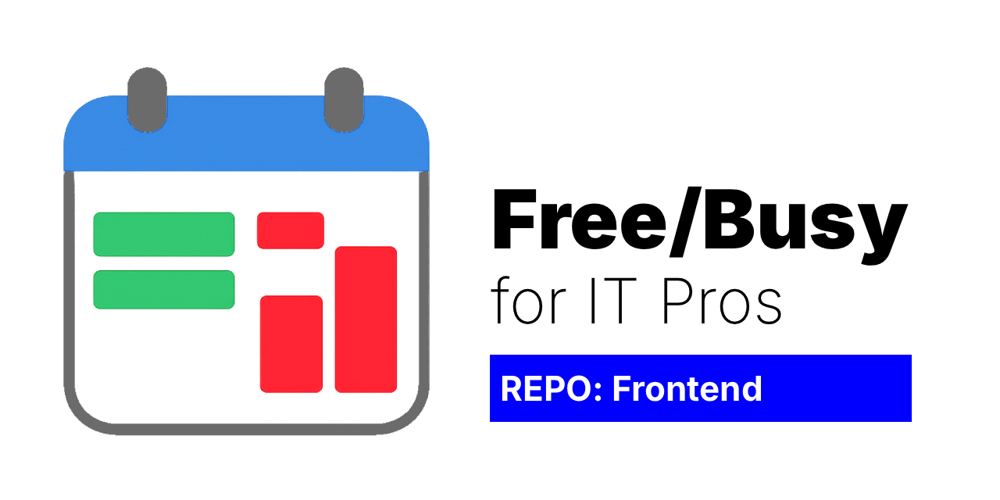

# freebusy-site

A professional free/busy calendar viewer for sharing your availability.

This is the **frontend** for displaying calendar availability. It connects to the [Freebusy API](https://github.com/robertsinfosec/freebusy-api) backend, which normalizes a private iCalendar feed into a minimal JSON payload safe for public display.

[](https://github.com/robertsinfosec/freebusy-site/actions/workflows/ci.yml)
[](https://github.com/robertsinfosec/freebusy-site/actions/workflows/ci.yml)
[](https://codecov.io/gh/robertsinfosec/freebusy-site)
[](https://github.com/robertsinfosec/freebusy-site/actions/workflows/codeql.yml)
[](https://github.com/robertsinfosec/freebusy-site/security/code-scanning)
[](https://github.com/robertsinfosec/freebusy-site/blob/main/src/package.json)
[](https://github.com/robertsinfosec/freebusy-site/blob/main/LICENSE)
[](https://github.com/robertsinfosec/freebusy-site/releases)
[](https://github.com/robertsinfosec/freebusy-site/commits/main)
[](https://github.com/robertsinfosec/freebusy-site/issues)
[](https://github.com/robertsinfosec/freebusy-site/pulls)
[](https://github.com/robertsinfosec/freebusy-site/security/dependabot)



## Features

- **Multi-day calendar view** - See availability across multiple weeks
- **Timezone support** - View in any timezone while preserving owner-day semantics
- **Working hours** - Displays configured working hours schedule
- **Responsive design** - Works on desktop and mobile
- **Dark mode** - Automatic theme switching
- **Export** - Copy availability as formatted text
- **Privacy-first** - No event details, only free/busy status

## Quick Start

Deploy your own instance in minutes.

### Prerequisites

- **GitHub account**
- **Cloudflare account** (free tier works)
- **Deployed Freebusy API** - See [freebusy-api](https://github.com/robertsinfosec/freebusy-api) for backend setup

### 1. Fork Repository

Click the **Fork** button at the top right of this page to create your own copy.

### 2. Deploy to Cloudflare Pages

1. Log in to [Cloudflare Dashboard](https://dash.cloudflare.com/)
2. Navigate to **Pages** → **Create a project**
3. Connect your GitHub account
4. Select your forked `freebusy-site` repository
5. Configure build settings:
   
   ```
   Production branch:     main
   Build command:         npm run build
   Build output directory: dist
   Root directory:        src
   ```

6. Add environment variable:
   
   ```
   Variable Name:  VITE_FREEBUSY_API
   Value:          https://your-freebusy-api.example.com/freebusy
   ```
   
   Replace with your actual Freebusy API endpoint URL.

7. Click **Save and Deploy**

### 3. Access Your Site

Your site will be available at:

```
https://freebusy-site-xxx.pages.dev
```

To use a custom domain, see [Custom Domains](#custom-domains) below.

## Configuration

The site requires one environment variable.

### Environment Variable

**`VITE_FREEBUSY_API`** (required)

- **Description:** URL of your Freebusy API endpoint
- **Example:** `https://api.freebusy.example.com/freebusy`
- **Where to set:** Cloudflare Pages → Settings → Environment variables

> [!IMPORTANT]
> After changing environment variables in Cloudflare Pages, you must redeploy (push a commit or click "Retry deployment").

## Custom Domains

To use your own domain (e.g., `calendar.example.com`):

1. Go to **Pages** → Your project → **Custom domains**
2. Click **Set up a custom domain**
3. Enter your domain
4. Follow the DNS setup instructions
5. Wait for DNS propagation (24-48 hours)

## API Integration

This frontend requires a deployed [Freebusy API](https://github.com/robertsinfosec/freebusy-api) backend.

### API Contract

The API contract is documented in [docs/openapi.yaml](docs/openapi.yaml).

### Key Endpoints

- **`GET /freebusy`** - Returns availability data
- **`GET /health`** - Health check endpoint

See the [freebusy-api repository](https://github.com/robertsinfosec/freebusy-api) for backend setup and configuration.

## Documentation

Comprehensive documentation for users and contributors.

### For Users

- **[OpenAPI Specification](docs/openapi.yaml)** - API contract and time semantics
- **[Product Requirements](docs/PRD.md)** - Project requirements and goals
- **[Security Policy](SECURITY.md)** - Security and vulnerability reporting

### For Contributors

- **[Setup Guide](docs/dev/SETUP.md)** - Dev environment setup
- **[Architecture Guide](docs/dev/ARCHITECTURE.md)** - Code structure and design
- **[Testing Guide](docs/dev/TESTING.md)** - Writing and running tests
- **[Deployment Guide](docs/dev/DEPLOYMENT.md)** - Deployment and operations
- **[Codecov Guide](docs/dev/CODECOV.md)** - Coverage tracking
- **[Style Guide](STYLE_GUIDE.md)** - Coding standards
- **[Contributing Guide](CONTRIBUTING.md)** - How to contribute

## Contributing

Contributions are welcome! Please see [CONTRIBUTING.md](CONTRIBUTING.md) for guidelines.

### Quick Links for Contributors

- **[Developer Setup](docs/dev/SETUP.md)** - Get started with development
- **[Code of Conduct](CODE_OF_CONDUCT.md)** - Community guidelines
- **[Issues](https://github.com/robertsinfosec/freebusy-site/issues)** - Report bugs or request features
- **[Pull Requests](https://github.com/robertsinfosec/freebusy-site/pulls)** - Submit contributions

## Security

Security is a top priority for this project.

### Reporting Vulnerabilities

- **Preferred:** [GitHub Security Advisories](https://github.com/robertsinfosec/freebusy-site/security/advisories)
- **Email:** `security@robertsinfosec.com`
- **security.txt:** `/.well-known/security.txt`

Please see [SECURITY.md](SECURITY.md) for our full security policy.

## License

MIT — see `LICENSE`.

---


