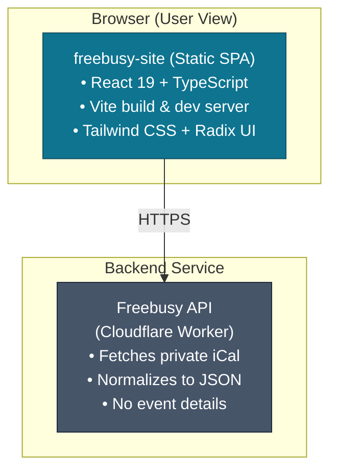
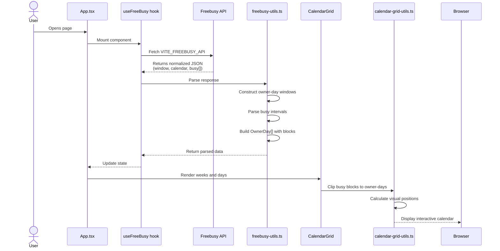
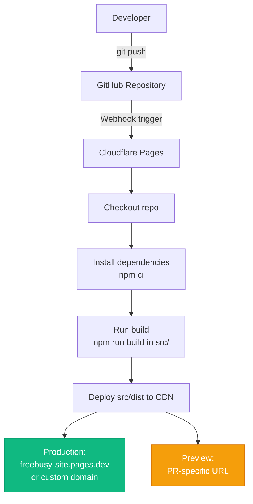

# Architecture

> **Status**: Living document  
> **Last Updated**: April 8, 2026  
> **Related**: [PRD](PRD.md) · [Setup](dev/SETUP.md) · [Testing](dev/TESTING.md)

Complete architectural overview of the freebusy-site frontend — a React + Vite single-page application that renders a professional free/busy calendar view.

## System Overview



### Scope and Boundaries

- **In scope**: React frontend that renders free/busy calendar from normalized API response
- **Out of scope**: iCal parsing (done by Freebusy API), event details, scheduling logic
- **Primary contract**: [OpenAPI spec](openapi.yaml) defines the Freebusy API response schema
- **Deployment**: Static site hosted on Cloudflare Pages

## Repository Layout

```
/
├── docs/                       # All documentation
│   ├── ARCHITECTURE.md         # This file: system design and data flow
│   ├── PRD.md                  # Product requirements and features
│   ├── openapi.yaml            # API contract and time semantics
│   └── dev/                    # Developer guides
│       ├── SETUP.md            # Local development setup
│       ├── TESTING.md          # Testing strategy and coverage
│       ├── DEPLOYMENT.md       # Deployment procedures
│       └── CODECOV.md          # Code coverage configuration
├── src/                        # npm package root (Vite workspace)
│   ├── package.json            # Dependencies and scripts
│   ├── vite.config.ts          # Vite build configuration
│   ├── tailwind.config.js      # Tailwind design tokens
│   ├── tsconfig.json           # TypeScript compiler config
│   ├── public/                 # Static assets (served as-is)
│   │   ├── .well-known/        # Security.txt and other metadata
│   │   └── version.txt         # Build version (generated)
│   └── src/                    # Application source code
│       ├── main.tsx            # React entry point
│       ├── App.tsx             # Root component
│       ├── components/         # React components
│       ├── hooks/              # Custom React hooks
│       ├── lib/                # Utility functions
│       └── styles/             # Global CSS and theme
└── scripts/                    # Build and tooling scripts
```

## Time Semantics (Critical Correctness Contract)

> [!CAUTION]
> This is the **most important architectural constraint** in the entire frontend. Violating these rules causes day columns to shift when viewers change timezones — a confusing and incorrect user experience.

### Owner-Day Authority

> [!NOTE]
> **Day columns are always anchored to the calendar owner's timezone.**

- The API response includes `calendar.timeZone` (IANA identifier like `America/New_York`)
- The API response includes `window.startDate` → `window.endDateInclusive` (ISO date strings in owner's timezone)
- Frontend **must not** recalculate day boundaries based on viewer timezone
- Each day column represents a full calendar day in the **owner's timezone**, regardless of who is viewing

### Viewer Timezone (Display Only)

> [!NOTE]
> **Viewer timezone changes only affect visual presentation, not data structure.**

- Viewer can select a display timezone from a US timezone dropdown
- Viewer timezone affects:
  - Hour labels on Y-axis (e.g., "9am PT" vs "12pm ET")
  - Vertical position of busy blocks (shifts hours but not days)
- Viewer timezone **does not** affect:
  - Number of day columns
  - Day column labels (always owner-day dates)
  - Which day a busy block appears in (determined by UTC instant clipped to owner-day)

### Busy Intervals

> [!NOTE]
> **Busy blocks are UTC instants clipped to owner-day boundaries.**

- API returns busy intervals as ISO 8601 UTC timestamps: `[startUtc, endUtc)`
- Frontend interprets each interval as a half-open range: `[start, end)`
- Each busy interval is clipped to the owner-day windows and rendered within the corresponding day column
- All-day events (`kind: "allDay"`) span the entire owner-day column (full height)

### Why This Matters

> [!IMPORTANT]
> **Example**: Owner is in New York (ET). They have a meeting Wednesday 11pm ET (Thursday 4am UTC).
> - **Correct**: Meeting appears in Wednesday column (owner's Wednesday)
> - **Incorrect**: Don't shift it to Thursday because a viewer in Tokyo would see Thursday

**Implementation Files**:
- Owner-day parsing and window generation: [`hooks/freebusy-utils.ts`](../src/src/hooks/freebusy-utils.ts)
- Timezone-safe date utilities: [`lib/date-utils.ts`](../src/src/lib/date-utils.ts)
- Busy block clipping and layout: [`components/calendar-grid-utils.ts`](../src/src/components/calendar-grid-utils.ts)

## Data Flow



## Key Modules

### React Components

| Component | Responsibility | Location |
|-----------|---------------|----------|
| `App.tsx` | Root component, coordinates state and layout | [`src/src/App.tsx`](../src/src/App.tsx) |
| `AppHeader` | Title, timezone selector, theme toggle, "Book Meeting" CTA | [`src/src/components/AppHeader.tsx`](../src/src/components/AppHeader.tsx) |
| `CalendarGrid` | Week and day column layout | [`src/src/components/CalendarGrid.tsx`](../src/src/components/CalendarGrid.tsx) |
| `WeekSection` | Individual week container | [`src/src/components/WeekSection.tsx`](../src/src/components/WeekSection.tsx) |
| `AvailabilityCard` | Single owner-day with busy blocks | [`src/src/components/AvailabilityCard.tsx`](../src/src/components/AvailabilityCard.tsx) |
| `AvailabilityLoadingCard` | Skeleton state during fetch | [`src/src/components/AvailabilityLoadingCard.tsx`](../src/src/components/AvailabilityLoadingCard.tsx) |
| `ThemeToggle` | Light/dark mode switcher | [`src/src/components/ThemeToggle.tsx`](../src/src/components/ThemeToggle.tsx) |

### Hooks

| Hook | Responsibility | Location |
|------|---------------|----------|
| `useFreeBusy` | Fetches and manages Freebusy API state | [`src/src/hooks/use-freebusy.ts`](../src/src/hooks/use-freebusy.ts) |
| `useMobile` | Detects mobile viewport for responsive behavior | [`src/src/hooks/use-mobile.ts`](../src/src/hooks/use-mobile.ts) |

### Core Libraries

| Module | Responsibility | Location |
|--------|---------------|----------|
| `freebusy-utils.ts` | Parse API response, construct owner-day windows, parse busy intervals | [`src/src/hooks/freebusy-utils.ts`](../src/src/hooks/freebusy-utils.ts) |
| `date-utils.ts` | Timezone-safe date manipulation using `Intl` APIs | [`src/src/lib/date-utils.ts`](../src/src/lib/date-utils.ts) |
| `calendar-grid-utils.ts` | Clip busy blocks to owner-day boundaries, calculate visual positions | [`src/src/components/calendar-grid-utils.ts`](../src/src/components/calendar-grid-utils.ts) |
| `availability-export.ts` | Generate plain-text availability summary for copy/paste | [`src/src/lib/availability-export.ts`](../src/src/lib/availability-export.ts) |
| `ical-parser.ts` | Parse iCal format (legacy, may be removed) | [`src/src/lib/ical-parser.ts`](../src/src/lib/ical-parser.ts) |
| `us-timezones.ts` | US timezone list and display labels | [`src/src/lib/us-timezones.ts`](../src/src/lib/us-timezones.ts) |

## Configuration

### Environment Variables

| Variable | Required | Description | Example |
|----------|----------|-------------|---------|
| `VITE_FREEBUSY_API` | Yes | URL of Freebusy API endpoint | `https://api.freebusy.example.com/freebusy` |

> [!TIP]
> Set in Cloudflare Pages **Settings → Environment Variables** for production and preview deployments.

For local development, create `src/.env.local`:
```bash
VITE_FREEBUSY_API=http://localhost:8787/freebusy
```

### Build Configuration

- **Build command**: `npm run build` (runs in `src/` directory)
- **Output directory**: `src/dist`
- **Root directory**: `src` (Cloudflare Pages setting)
- **Node version**: Specified in `src/package.json` `engines.node` field

## Deployment Architecture



### Hosting

- **Platform**: Cloudflare Pages
- **Static assets**: Served from global CDN
- **Runtime dependencies**: None (pure static site)
- **API calls**: Frontend makes client-side HTTPS requests to Freebusy API

### Security

- **`security.txt`**: Published at `/.well-known/security.txt` (source: [`src/public/.well-known/security.txt`](../src/public/.well-known/security.txt))
- **CSP**: Configured at Cloudflare Pages level (not in source)
- **HTTPS**: Enforced by Cloudflare Pages
- **Secrets**: No secrets in frontend code; API key managed by backend

## Testing Architecture

- **Test framework**: Vitest
- **Component testing**: React Testing Library + jsdom
- **Coverage target**: 75% minimum (enforced in CI), stretch goal 80%
- **Coverage tool**: v8 (Vitest default)
- **Test location**: Co-located `*.test.ts` and `*.test.tsx` files

**Key test files**:
- Time semantics: [`lib/date-utils.test.ts`](../src/src/lib/date-utils.test.ts)
- Owner-day parsing: [`hooks/freebusy-utils.test.ts`](../src/src/hooks/freebusy-utils.test.ts)
- Busy block clipping: [`components/calendar-grid-utils.test.ts`](../src/src/components/calendar-grid-utils.test.ts)
- API integration: [`hooks/use-freebusy.test.tsx`](../src/src/hooks/use-freebusy.test.tsx)

See [TESTING.md](dev/TESTING.md) for detailed testing strategy.

## Design System

### UI Framework

- **Base**: Tailwind CSS 4 with custom design tokens
- **Component library**: Radix UI primitives (unstyled, accessible)
- **Icons**: Phosphor Icons (`@phosphor-icons/react`)
- **Theme**: CSS custom properties for light/dark mode

### Theme Architecture

Theme tokens defined in [`src/src/styles/theme.css`](../src/src/styles/theme.css):
- Radix color scales imported for semantic color system
- CSS custom properties exposed to Tailwind via `tailwind.config.js`
- Dark mode: Uses `prefers-color-scheme` + manual toggle

### Typography

- **Font family**: Inter (Google Fonts)
- **Weights**: 400 (regular), 500 (medium), 600 (semi-bold), 700 (bold)
- **Loaded via**: Google Fonts CDN with `preconnect` optimization

## API Contract

> [!NOTE]
> The frontend depends on the Freebusy API response schema documented in [`docs/openapi.yaml`](openapi.yaml).

**Key response structure**:
```typescript
{
  window: {
    startDate: string         // ISO date in owner TZ
    endDateInclusive: string  // ISO date in owner TZ
  }
  calendar: {
    timeZone: string          // IANA timezone (e.g., "America/New_York")
    workingHours: {
      startHour: number       // 0-23
      endHour: number         // 0-23
      weekdays: number[]      // ISO weekdays: 1=Mon, 7=Sun
    }
  }
  busy: Array<{
    startUtc: string          // ISO 8601 UTC timestamp
    endUtc: string            // ISO 8601 UTC timestamp
    kind: "default" | "allDay"
  }>
}
```

**Error handling**:
- HTTP 429: Rate limited → display retry countdown
- HTTP 410: Disabled → display "Calendar unavailable"
- HTTP 503: Service unavailable → display retry option
- Network errors: Show error message with manual retry

## Future Considerations

> [!CAUTION]
> These are not current features but are documented to guide future architectural decisions. Do not implement without architectural review.

- **Multi-calendar support**: Would require backend changes to merge multiple iCal feeds
- **Event details**: Intentionally excluded for privacy; would require user authentication
- **Booking integration**: Currently links to external Cal.com; could integrate booking form
- **iCal export**: Could generate `.ics` file of available slots
- **Internationalization**: Currently US-centric (timezone list, date formats)

## Decision Records

> [!NOTE]
> For significant architectural decisions, see `docs/ADR/` (if/when created).

---

> [!WARNING]
> **Maintenance**: Update this document when making changes that affect system boundaries, data flow, or module responsibilities. Keep it synchronized with code changes.
