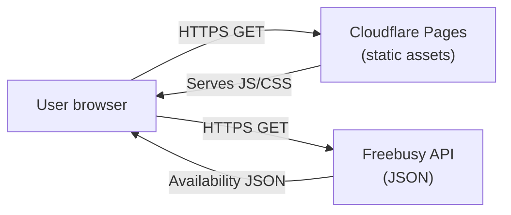
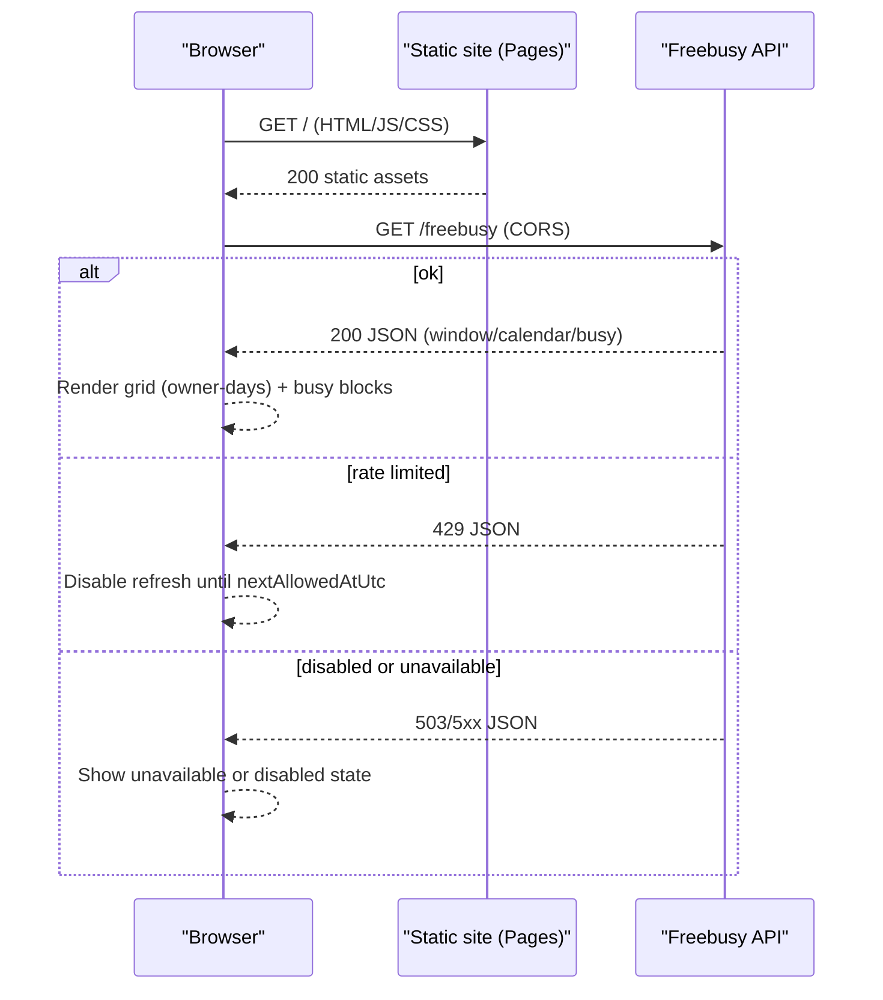

# Threat Model (freebusy-site frontend)

Last reviewed: 2025-12-30

This document is a threat model for the free/busy calendar viewer site (React/Vite SPA).

This is not a penetration test report. It captures security-relevant architecture, threats, and test hypotheses to guide engineering work and to focus any future independent assessment.

- [Threat Model (freebusy-site frontend)](#threat-model-freebusy-site-frontend)
  - [0. Summary](#0-summary)
  - [1. Scope and assumptions](#1-scope-and-assumptions)
    - [1.1 Ownership and review](#11-ownership-and-review)
    - [1.2 In scope](#12-in-scope)
    - [1.3 Out of scope](#13-out-of-scope)
    - [1.4 Assumptions](#14-assumptions)
  - [2. Assets](#2-assets)
  - [3. Trust boundaries and data flows](#3-trust-boundaries-and-data-flows)
    - [3.1 System context](#31-system-context)
    - [3.2 Runtime flow (simplified)](#32-runtime-flow-simplified)
  - [4. Threat analysis (STRIDE)](#4-threat-analysis-stride)
    - [4.1 Spoofing](#41-spoofing)
    - [4.2 Tampering](#42-tampering)
    - [4.3 Repudiation](#43-repudiation)
    - [4.4 Information disclosure](#44-information-disclosure)
    - [4.5 Denial of service](#45-denial-of-service)
    - [4.6 Elevation of privilege](#46-elevation-of-privilege)
  - [5. Security requirements (control objectives)](#5-security-requirements-control-objectives)
  - [6. Detection and response](#6-detection-and-response)
  - [7. Pen test guidance](#7-pen-test-guidance)
    - [7.1 Pen test requirements](#71-pen-test-requirements)
    - [7.2 Focus areas flagged by this threat model](#72-focus-areas-flagged-by-this-threat-model)
  - [8. Risk register](#8-risk-register)

## 0. Summary

This section describes the system at a high level and highlights the most important security and privacy risks. It is intended to be readable by both engineers and non-engineering stakeholders. It should stay short and emphasize what matters most.

freebusy-site is a public single-page app that fetches availability data from the Freebusy API and renders a calendar grid.

The highest-value risks for this frontend are typically:

- **XSS or HTML injection:** Any path that renders untrusted strings as raw HTML can lead to script execution.
- **Supply chain compromise:** Dependency or CI/CD tampering can ship malicious code to every user.
- **Misconfiguration:** Pointing at the wrong API origin or allowing insecure transport can break integrity and privacy.
- **Privacy leakage:** Availability data is sensitive-ish and should not be accidentally logged or cached.

Project-specific notes:

- **No authenticated session:** The UI does not maintain a session and does not perform state-changing requests.
- **Rendering model:** The UI renders API-provided strings via React (escaped by default).
- **Injection sinks:** A small number of components use `dangerouslySetInnerHTML`, which must be treated as security-sensitive.

## 1. Scope and assumptions

This section defines what this threat model does and does not cover. It also makes assumptions explicit so readers can tell when the model needs to be revisited. Keeping this section accurate is essential for avoiding false confidence.

### 1.1 Ownership and review

This subsection defines who owns the document and when it should be reviewed. Threat models drift over time, so review triggers should be tied to specific classes of change.

- **Owner:** See CODEOWNERS.
- **Review cadence:** Quarterly, and after any security-relevant change.
- **Review triggers:** Any change to fetch behavior, error handling, rendering of API-provided strings, `dangerouslySetInnerHTML` usage, CSP or security headers, or CI/workflow/deploy configuration.

### 1.2 In scope

This subsection lists the parts of the system that are explicitly analyzed. If a component can affect confidentiality, integrity, or availability for users, it should generally be included here.

- **Application behavior:** React/Vite SPA behavior and rendering.
- **Network behavior:** Frontend fetch behavior and error handling.
- **Configuration:** Frontend configuration (`VITE_*` variables) and release pipeline.
- **Hosting posture:** Static hosting posture (Cloudflare Pages headers, caching).

### 1.3 Out of scope

This subsection makes boundaries explicit. Out-of-scope items may still matter, but they are handled in separate documents or by separate teams.

- **Backend internals:** See the Freebusy API repo threat model.
- **Account-level controls:** Cloudflare account controls (2FA, RBAC, audit logs), except as recommended mitigations.
- **Endpoint compromise:** End-user device compromise.

### 1.4 Assumptions

This subsection lists assumptions that, if violated, change the threat model materially. Assumptions should be reviewed any time an architecture or product decision changes.

- **API source of truth:** The Freebusy API is the source of truth for all busy interval data.
- **Public nature:** The UI is intended to be public and is safe to scrape (availability data is intentionally shared).
- **No secrets in frontend:** `VITE_*` variables are not secrets (they are embedded into the built JS).

## 2. Assets

This section enumerates the assets we are protecting and the reason they matter. Assets can be “data” (availability information) or “capabilities” (deploy configuration). These labels are referenced later in threats and the risk register.

- **A1 Availability data:** Busy intervals and working hours, sensitive-ish (privacy).
- **A2 Correctness trust:** Timezone and day-column correctness, integrity.
- **A3 Site availability:** Ability to load and render the UI, availability.
- **A4 Deployment configuration:** `VITE_FREEBUSY_API` and security headers, integrity.
- **A5 Supply chain integrity:** Dependencies and workflows, integrity.

## 3. Trust boundaries and data flows

This section documents the system’s trust boundaries and the overview flow of data through the system. The diagrams are intentionally simplified so they remain stable even as implementation details change. If a trust boundary changes, the threat model should be revisited.

### 3.1 System context

This diagram shows the primary actors and the top-level network relationships. It is used to reason about trust boundaries, origins, and what data crosses between components.

### 3.2 Runtime flow (simplified)

This diagram shows the request sequence from initial page load through API fetch. It is used to reason about error handling, caching, and rate-limiting interactions. Details such as polling intervals are intentionally omitted.

## 4. Threat analysis (STRIDE)

This section uses STRIDE to organize threats by category. For each category, it calls out the threat, likely impact, and the controls that reduce risk. Where relevant, it also highlights what a pentester should validate.

### 4.1 Spoofing

This subsection focuses on impersonation or tricking users into interacting with a malicious system. For a static SPA, the most relevant spoofing risks are domain and asset integrity. Authentication spoofing is not applicable today because there is no session.

- **Threat:** Users tricked into loading a malicious build (typosquatting or compromised origin).
- **Impact:** Full client compromise if an attacker controls assets.
- **Current mitigations:** HSTS and correct DNS; publish canonical URLs; ensure Pages deploys only from protected branches.

### 4.2 Tampering

This subsection focuses on unauthorized modification of code, configuration, or data. For this project, that primarily means supply chain risk and misconfiguration of the API endpoint. Tampering risk matters even for read-only apps because integrity and trust are assets.

- **Threat:** Supply chain tampering (npm dependencies, build pipeline, GitHub Actions).
- **Current controls:** Lockfile, Dependabot, CI, CodeQL.
- **Recommended mitigations:** Pin GitHub Actions to commit SHAs; branch protections; require reviews for workflow changes.

- **Threat:** Misconfiguration points the UI at an incorrect or insecure API origin.
- **Impact:** Data integrity and user trust issues; potential privacy leakage if mixed origins are used.
- **Recommended mitigations:** Deploy-time checks; enforce HTTPS for production API endpoints.

### 4.3 Repudiation

This subsection focuses on disputes about actions that occurred and the ability to investigate incidents. The SPA is intentionally lightweight, so the goal is not to build deep client-side audit logging. The goal is to avoid leaking sensitive data while keeping failure modes understandable.

- **Threat:** Limited auditability for why the UI showed a given state.
- **Impact:** Harder to investigate incidents or bug reports.
- **Recommended mitigations:** Keep error states explicit; avoid logging sensitive payloads.

### 4.4 Information disclosure

This subsection focuses on confidentiality and privacy risks. For a public free/busy viewer, “public” does not mean “non-sensitive,” so accidental leakage via XSS, logs, or caching still matters. The most severe impact typically comes from script execution (XSS).

- **Threat:** XSS leading to data exfiltration.
- **Baseline posture:** React escapes string content by default.
- **Notable injection sink:** `dangerouslySetInnerHTML` exists for chart `<style>` injection.
- **Recommended mitigations:** Treat `dangerouslySetInnerHTML` as security-sensitive; constrain and sanitize inputs; prefer a strict CSP.

- **Threat:** Debug logging leaks availability details.
- **Relevant behavior:** The iCal parsing module includes optional debug logging gated by `VITE_DEBUG_ICAL` in dev mode.
- **Recommended mitigations:** Ensure debug flags cannot be enabled in production builds; treat console logs as potentially sensitive.

- **Threat:** Response caching in browsers or CDNs.
- **Impact:** Privacy leakage via caches.
- **Recommended mitigations:** Ensure hosting and API set appropriate cache controls for sensitive-ish responses.

### 4.5 Denial of service

This subsection focuses on availability risks. The SPA itself is cheap to serve, but it can still amplify load on the API through polling and user-driven refresh. The most important control is generally backend rate limiting, but the frontend should behave responsibly.

- **Threat:** UI repeatedly refreshes or is scraped (self-DoS or abusive traffic patterns).
- **Current controls:** Backend rate limiting; UI disables refresh until `nextAllowedAtUtc`.
- **Recommended mitigations:** Confirm client behavior cannot be coerced into hot loops; rely on backend controls for abuse cases.

### 4.6 Elevation of privilege

This subsection focuses on gaining capabilities beyond what was intended. For a browser client, the most relevant “privilege elevation” is turning an injection bug into full script execution. Once script executes, the attacker effectively controls the app for that user.

- **Threat:** If XSS occurs, attacker gains full same-origin script execution.
- **Impact:** Full compromise of any data rendered in the page and ability to call backend as the browser.
- **Recommended mitigations:** CSP; minimize injection sinks.

## 5. Security requirements (control objectives)

This section lists concrete, testable security requirements derived from the threat analysis. These should be treated as control objectives for engineering, CI, and (where possible) external validation. If a requirement changes, update the threat model and any adjacent tests or runbook items.

- **No raw HTML from untrusted data:** API-returned strings must be rendered as text, not HTML.
- **Constrained injection sinks:** Any `dangerouslySetInnerHTML` usage must use constrained inputs and receive explicit review.
- **No secrets in the bundle:** `VITE_*` variables must not contain secrets.
- **Anti-clickjacking:** The deployed site must not be frameable by untrusted origins.
- **Transport security:** Production deployments must be HTTPS-only with HSTS.

## 6. Detection and response

This section describes how to detect failures and how to respond when assumptions are violated. It is intentionally brief, with the expectation that detailed runbooks live elsewhere. Detection should focus on signals that are actionable and do not require sensitive data to collect.

- **Monitor:** Spikes in API errors, sustained rate limiting, unusual client-side render errors, and CSP violations (consider CSP Report-Only during rollout).
- **Triage:** Determine whether issues are caused by backend availability, deploy/config changes, or abusive traffic.
- **Mitigate quickly:** Adjust headers and CSP, tighten deploy controls, and coordinate with backend rate limiting and caching posture.
- **Post-incident:** Update this threat model if assumptions or controls changed.

## 7. Pen test guidance

This section provides guidance for commissioning an independent assessment. It states expectations for methodology, evidence, and severity modeling. It also lists the project-specific areas a tester should scrutinize based on this threat model.

This document is a threat model, not a penetration test report, and it does not claim that testing has been performed.

If you engage an independent tester, we recommend an assessment aligned with:

- **OWASP Web Security Testing Guide (WSTG):** https://owasp.org/www-project-web-security-testing-guide/
- **OWASP Top 10 (web):** https://owasp.org/www-project-top-ten/
- **OWASP API Security Top 10:**
  - **Project page:** https://owasp.org/www-project-api-security/
  - **Top 10 list (2023):** https://owasp.org/API-Security/editions/2023/en/0x11-t10/

### 7.1 Pen test requirements

This subsection describes the minimum requirements for a useful, reproducible assessment. These requirements are intended to prevent ambiguous findings and to ensure the report is actionable. If scope is limited, it should be explicitly documented.

- **Targets:** Test the deployed Cloudflare Pages site (headers, CSP, caching behavior, built assets).
- **API dependency:** Treat the Freebusy API as a dependency; at minimum, black-box test the browser-facing endpoint and its CORS posture.
- **Report quality:** Include evidence (request/response, screenshot, console trace), remediation guidance, and retest criteria.
- **Severity model:** Use a consistent severity model (CVSS-based or a rubric agreed in the Rules of Engagement).

### 7.2 Focus areas flagged by this threat model

This subsection calls out the project-specific checks that matter most for this system. These are derived from the threat analysis above and should remain stable across testers. If new sinks or new auth flows are introduced, revisit this list.

- **XSS and injection:** Validate whether any `dangerouslySetInnerHTML` inputs can become attacker-controlled, and validate that API-returned strings are never rendered as raw HTML.
- **Security headers:** Verify CSP, `frame-ancestors` or equivalent clickjacking protection, HSTS, referrer policy, and permissions policy.
- **CORS posture:** Confirm the Freebusy API enforces an origin allowlist appropriate for browser access (note: CORS is not authentication).
- **Error and rate-limit handling:** Confirm error responses do not induce sensitive leaks into logs or the DOM, and confirm rate-limit responses cannot be abused to induce pathological client behavior.

## 8. Risk register

This section summarizes key risks in a compact, comparable form. It is not intended to be exhaustive; it is intended to communicate what matters most and how mitigations change risk over time. The rationale and context for each risk should be captured in the threats and control objectives above.

| ID | Risk | Likelihood | Impact | Current controls | Suggested improvement |
|---:|------|------------|--------|------------------|----------------------|
| R1 | XSS via an injection sink | Low/Med | High | React escaping | Add CSP; keep sinks constrained |
| R2 | Supply-chain compromise | Low | High | Dependabot + lockfile + CodeQL | Pin actions; branch protections |
| R3 | Misconfigured API endpoint or insecure transport | Med | Med | Env-based config | Enforce `https` in prod; deploy checks |
| R4 | Debug logging leaks sensitive info | Low | Med | Dev-only guard | Ensure never enabled in prod |

