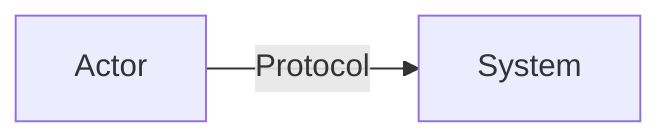
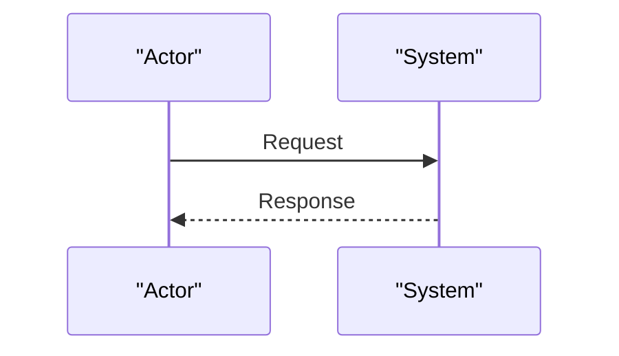

# Threat Model (SERVICE NAME)

Last reviewed: YYYY-MM-DD

This document is a threat model for SERVICE NAME.

This is not a penetration test report. It captures security-relevant architecture, threats, and test hypotheses to guide engineering work and to focus any future independent assessment.

## 0. Summary

This section describes the system at a high level and highlights the most important risks. It is intended to be readable by both engineers and non-engineering stakeholders. Keep it short and emphasize what matters most.

One paragraph describing what the system is and what it does.

Bullets for the highest-value risks:

- **Example XSS or HTML injection:** Brief explanation.
- **Example supply chain compromise:** Brief explanation.
- **Example misconfiguration or insecure transport:** Brief explanation.
- **Example privacy leakage:** Brief explanation.

## 1. Scope and assumptions

This section defines what the threat model covers and the assumptions it depends on. It should prevent misunderstandings about scope and avoid false confidence. Review it whenever the architecture or operational posture changes.

### 1.1 Ownership and review

This subsection defines who owns the document and when it should be reviewed. Review triggers should be tied to specific classes of change. Keep the triggers short but concrete.

- **Owner:** See CODEOWNERS.
- **Review cadence:** Quarterly, and after any security-relevant change.
- **Review triggers:** List the specific change types that should force a review.

### 1.2 In scope

This subsection lists the components and behaviors that are explicitly analyzed. If a component can affect confidentiality, integrity, or availability, it should generally appear here. Keep the list aligned to how the system is deployed.

- **Components:** List what code and infrastructure is covered.

### 1.3 Out of scope

This subsection lists items that are intentionally excluded. These may be covered by other documents or by separate teams. Being explicit here helps readers interpret the rest of the model correctly.

- **Exclusions:** List what is explicitly not covered.

### 1.4 Assumptions

This subsection lists assumptions that, if violated, materially change the threat model. Assumptions should be reviewed any time product or architecture decisions change. Prefer assumptions that are testable or operationally verifiable.

- **Assumptions:** List assumptions you depend on (secrets, trust boundaries, intended public/private nature).

## 2. Assets

This section enumerates the assets you are protecting and why they matter. Assets include data, capabilities, and reputational trust. These IDs are referenced later in threats and the risk register.

- **A1 Asset name:** Confidentiality/integrity/availability impact.
- **A2 Asset name:** Confidentiality/integrity/availability impact.

## 3. Trust boundaries and data flows

This section documents the system’s trust boundaries and how data moves between components. Diagrams should be simplified and stable over time. Update this section whenever a trust boundary changes.

### 3.1 System context

This diagram shows the primary actors and top-level relationships. It should be sufficient to reason about origins, trust boundaries, and what data crosses between components. Keep it readable.

### 3.2 Request or runtime flow (simplified)

This diagram shows the key request sequence at runtime. It should help readers understand where validation, authorization, and error handling occurs. Avoid over-specifying implementation details.

## 4. Threat analysis (STRIDE)

This section captures threats and mitigations. Where appropriate, it also highlights test hypotheses that should be validated in a pentest.

### 4.1 Spoofing

This subsection focuses on impersonation or tricking users/systems into interacting with a malicious system. Choose threats that match your real trust boundaries. Keep mitigations concrete and verifiable.

- **Threat:** ...
- **Impact:** ...
- **Current mitigations:** ...
- **Optional mitigations:** ...

### 4.2 Tampering

This subsection focuses on unauthorized modification of code, configuration, or data. For many systems, supply chain and deploy configuration are high-value tampering targets. Document both current controls and recommended improvements.

### 4.3 Repudiation

This subsection focuses on auditability and the ability to investigate incidents. The goal is not necessarily to build perfect logs, but to have enough signal to respond safely. Avoid collecting sensitive data without a strong reason.

### 4.4 Information disclosure

This subsection focuses on confidentiality and privacy leakage. Consider XSS, logging, caching, and cross-origin data exposure where relevant. Highlight the highest-impact leakage paths.

### 4.5 Denial of service

This subsection focuses on availability risks, including abusive traffic, expensive code paths, and upstream dependencies. Prefer mitigations that are bounded and measurable. If rate limiting is used, describe the intended behavior.

### 4.6 Elevation of privilege

This subsection focuses on gaining capabilities beyond what was intended. In many systems, injection bugs and supply chain compromise are key privilege-elevation paths. Document how controls reduce blast radius.

## 5. Security requirements (control objectives)

This section lists concrete, testable security requirements derived from the threat analysis. These should be treated as control objectives for engineering and validation. If a requirement changes, update the threat model and any adjacent tests or runbook items.

- **Example secrets never logged:** Describe what must not be logged.
- **Example no caching for sensitive responses:** Describe expected cache headers and behavior.
- **Example CSP blocks inline scripts:** Describe expected policy and enforcement mode.

## 6. Detection and response

This section describes how to detect failures and how to respond when assumptions are violated. It should be short, with detailed runbooks living elsewhere. Focus on signals that are actionable and do not require sensitive data to collect.

- **Monitor:** ...
- **Triage:** ...
- **Mitigate quickly:** ...
- **Post-incident:** ...

## 7. Pen test guidance

This section provides guidance for commissioning an independent assessment. It states expectations for methodology, evidence, and severity modeling. It also lists the project-specific areas a tester should scrutinize based on this threat model.

This document is a threat model, not a penetration test report, and it does not claim that testing has been performed.

If you engage an independent tester, recommend a methodology and coverage (OWASP-aligned, if applicable):

- **OWASP Web Security Testing Guide (WSTG):** https://owasp.org/www-project-web-security-testing-guide/
- **OWASP Top 10 (web):** https://owasp.org/www-project-top-ten/
- **OWASP API Security Top 10:** https://owasp.org/www-project-api-security/

### 7.1 Pen test requirements

This subsection describes the minimum requirements for a useful, reproducible assessment. These requirements are intended to prevent ambiguous findings and to ensure the report is actionable. If scope is limited, it should be explicitly documented.

- **Scope:** What environments to test (prod/staging), black-box vs authenticated.
- **Evidence:** What evidence to include for reproducibility.
- **Severity model:** What scoring or rubric to use.

### 7.2 Focus areas flagged by this threat model

This subsection calls out the project-specific checks that matter most for this system. It should be derived from the threat analysis, not generic checklists. Keep it short, and update it when new high-risk code paths are introduced.

Bulleted list of the project-specific checks that matter most.

## 8. Risk register

This section summarizes key risks in a compact, comparable form. It is not intended to be exhaustive; it is intended to communicate what matters most and how mitigations change risk over time. The rationale and context for each risk should be captured in the threats and control objectives above.

| ID | Risk | Likelihood | Impact | Current controls | Suggested improvement |
|---:|------|------------|--------|------------------|----------------------|
| R1 | Example | Low | High | Example | Example |
